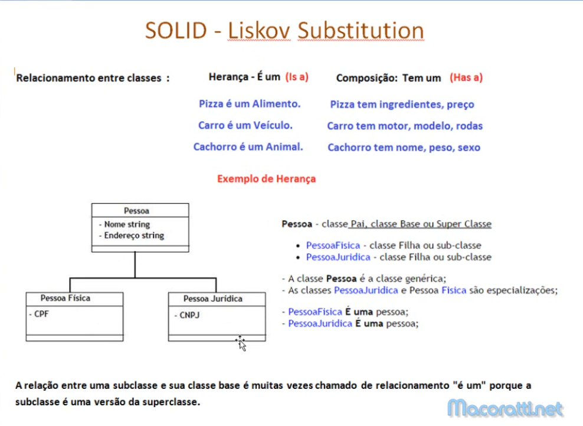
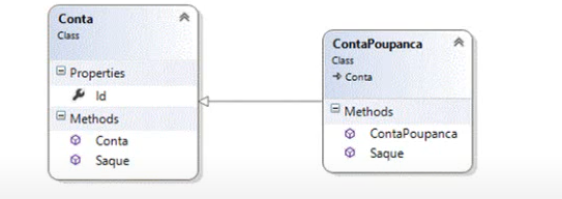

Este principio se aplica a Herança um dos pilares da programação orientada a objetos.

As classes bases devem poder ser substituidas por suas classes derivadas.
e Objetos das subclasses devem poder subistituir objetos das classes bases.

Porque o principio de Liskov é importante?

Pórque sem aplicacar o principio de Liskov a hierarquia de calsses seraia uma bagunça e os testes de unidade para a 
superClasse nunca teriam sucesso para a subclasse.

Intudução

cretitos a marcoratti.
https://www.youtube.com/watch?v=kNC1x8dlsH8

Exemplo Classes Conta e ContaPoupança;

A cçasse Conta Poupançaé uma Conta quetem uma caracteristica especial:
A cçasse ContaPoupanca herda da classe Conta e herda seus metodos 

A classe ContaPoupanca sobrescreve o metodos saque

Se o LSP ok -> usar a instanca de ContaPouanla no lugar de Conta não implica mudança de comportamento.

